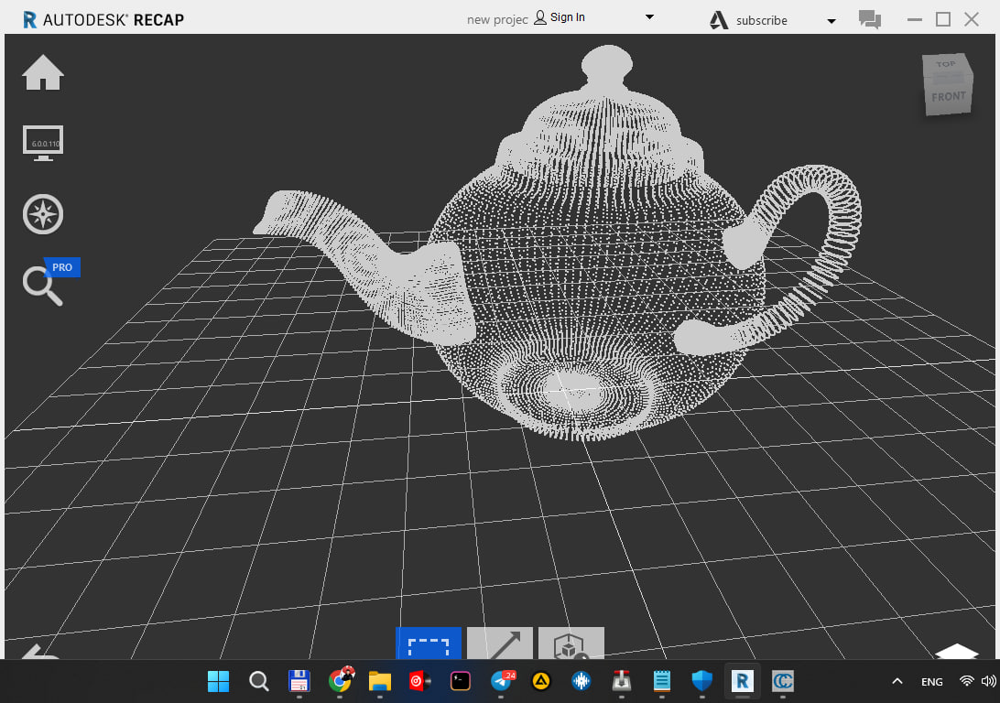
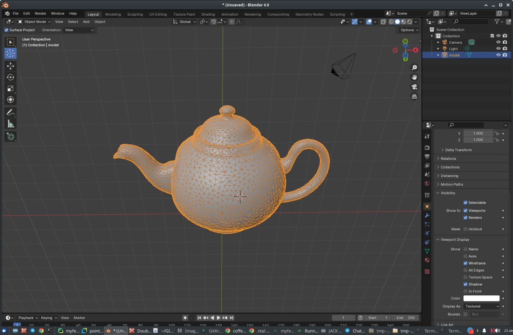

# Point cloud to solid model converter
## PROTOTYPE
This script combines the RCS/RCP(coming soon) PTS file reading functionality with Open3D's mesh simplification capabilities, allowing you to create solid modeling OBJ files with a specified level of detail.

### Install dependency:
pip install -r requirements.txt

